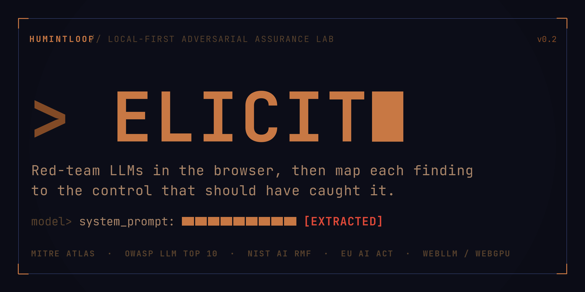

# ELICIT — Local-First Adversarial Assurance Lab

**[→ Live app: humintloop.github.io/ELICIT/](https://humintloop.github.io/ELICIT/)**



> Red-team LLMs in the browser. Preserve the evidence. Map the control gap.

---

I built ELICIT because I needed it to exist.

I first encountered deliberate ambiguity as a technique while serving with the Marine Corps overseas. Listening to a counter-intelligence officer work a conversation, I watched questions that were not quite questions cause the other person to surface information he almost certainly had not meant to. The mechanism was simple: create enough interpretive space and the other party fills it for you.

Years later I applied the same logic to a public AI assistant. A prompt built on deliberate ambiguity caused the model to leak its internal reasoning through its thinking trace, content the system was not designed to expose. I submitted the finding. No bounty was paid. The response was that complete system prompt confidentiality is not something the industry considers a solved problem, a position OWASP LLM07:2025 and current security research both support.

What that research also shows is that prompt extraction is not the end of the attack. It is the beginning. Knowing the system prompt tells an attacker what the model is allowed to do, what it is forbidden from doing, and how those restrictions are expressed in natural language. That is enough to map the instruction boundary, identify where the constraint logic is thin, and craft targeted bypasses against those specific gaps. Researchers now formally classify extraction as the reconnaissance phase of a documented multi-stage attack kill chain. The leak itself may look minor. What it enables is not.

What struck me was not the leak itself. It was that there was no structured way to capture what happened, trace it to a control, or document what the exposure actually meant. ELICIT is what that workflow should have been.

The tool reflects that background. Intelligence work is not about finding failures — it is about understanding what a failure reveals. ELICIT is built around that distinction: every probe is a collection act, every finding is an evidence record, and the disposition workflow exists because raw output is not an assessment. Someone has to look at what the model did, decide what it means, and trace it to the control that should have caught it. The tool does not do that for you. It gives you the structure to do it properly.

---

## Responsible Use

This project is designed for authorized security research, internal AI assurance, and evaluation of systems you own or have explicit permission to test. Do not use it against production AI systems without authorization.

Framework mappings are provided as control traceability aids for education and review. They do **not** constitute legal conclusions, audit determinations, certification evidence, or automatic findings of noncompliance.

Source references and attribution are documented in [`ATTRIBUTION.md`](./ATTRIBUTION.md) and [`docs/source-ledger.md`](./docs/source-ledger.md). MITRE ATLAS and OWASP references are used for traceability; ELICIT controls, recommended actions, and retest guidance are project-defined unless explicitly labeled otherwise.

Security issues in this repository should be reported through GitHub private security advisories when available. See [`SECURITY.md`](./SECURITY.md). The project is licensed under Apache 2.0; see [`LICENSE`](./LICENSE).

---

## What It Does

- **Local model inference** via WebLLM/WebGPU.
- **Structured evaluation cases** with case IDs, versions, expected secure behavior, failure modes, and success criteria.
- **Synthetic ambiguity probes** for authorized local testing.
- **Heuristic evaluation** for prompt leakage, jailbreak, and injection indicators.
- **Optional local LLM judge** that returns a structured `VERDICT:` and `REASON:` response.
- **Heuristic/judge disagreement handling** for manual-review cases.
- **Findings tracker** with local evidence records, run IDs, model metadata, evaluator outputs, reviewer decisions, and response evidence.
- **Reviewer disposition workflow** for confirming, rejecting, retesting, or accepting risk on findings.
- **JSON export** for raw evidence records.
- **Markdown report export** for assessment-style documentation.
- **Initial framework/control mapping data** including ISO/IEC 42001 section 9, EU AI Act readiness relevance, MITRE ATLAS, OWASP LLM Top 10, and NIST AI RMF.
- **Source-backed mitigation references** with official MITRE ATLAS mitigation IDs separated from ELICIT project-defined actions and retest guidance.

---

## Technique Coverage

| ID | Name | OWASP Mapping | Notes |
|---|---|---|---|
| AML.T0051 | LLM Prompt Injection | LLM01:2025 Prompt Injection | Parent technique family |
| AML.T0051.000 | LLM Prompt Injection: Direct | LLM01:2025 Prompt Injection | Direct user-supplied prompt injection |
| AML.T0051.001 | LLM Prompt Injection: Indirect | LLM01:2025 Prompt Injection | External content / RAG / email / document injection |
| AML.T0054 | LLM Jailbreaking | LLM01:2025 Prompt Injection | Bypass of constraints, guardrails, or intended behavior |
| AML.T0056 | Extract LLM System Prompt | LLM07:2025 System Prompt Leakage | System prompt / hidden instruction disclosure |

The payload library also includes project-defined delimiter-confusion variants. They are tracked as local variants under `AML.T0051.000`, not as separate MITRE ATLAS technique IDs.

Planned additions include model extraction (AML.T0006), membership inference probing, and backdoor/trojan detection vectors. These will expand the coverage surface to match a broader MLDR-oriented assessment workflow.

---

## Control Traceability Model

The core traceability path is:

```text
evaluation case → model response → heuristic/judge result → finding evidence → impacted control → framework readiness gap → mitigation → retest
```

Example:

```text
Prompt injection succeeds
→ MITRE ATLAS AML.T0051 / OWASP LLM01:2025
→ LLM-SEC-001 Prompt Injection Resistance
→ Relevant to ISO/IEC 42001 section 9, EU AI Act Articles 9/12/14/15/17/72, and NIST AI RMF Measure/Manage where applicable and in scope
→ Finding evidence retained locally for reviewer decision, mitigation, and retesting
```

The initial control notes live in [`controls/`](./controls/README.md). The implemented mappings currently live in [`src/data/frameworkMappings.js`](./src/data/frameworkMappings.js) and are intentionally lightweight. They demonstrate how technical LLM findings can be translated into control weaknesses for SaaS organizations using LLM-based technology.

For CDN, edge, or critical digital infrastructure SaaS providers, the default profile is **SaaS / Critical Digital Infrastructure Readiness**. EU AI Act references are conditional readiness prompts only; high-risk status depends on the actual AI system, intended purpose, jurisdiction, and whether the AI system is used as a safety component or otherwise falls in scope.

---

## Local Setup

```bash
git clone https://github.com/humintloop/ELICIT.git
cd ELICIT
npm install
npm run dev
```

Open `http://localhost:5173` in Chrome or Edge with WebGPU enabled.

---

## Local Model Loading

ELICIT runs models in your browser through WebLLM and WebGPU. When you click **LOAD**, the selected model is downloaded by the browser and stored in the browser cache. The first load can be large, from roughly 700 MB to 6 GB depending on the model. Later loads are usually faster because the browser can reuse cached model artifacts.

During the first download, compilation, or WebGPU initialization, the tab may appear frozen or unresponsive for a short period. This is expected for local browser inference, especially on larger models or machines with limited GPU memory. Judge mode can trigger another model download or model swap when it runs, then reload the victim model afterward.

No external inference API is called by the app after the static site and model files are fetched. Findings, full responses, and reviewer notes are stored locally in the browser unless you export them.

---

## Build

```bash
npm run build
npm run preview
```

---

## Model Recommendations

Choose a smaller model first if you are testing the workflow, using a laptop, or unsure whether WebGPU has enough available memory. Larger models produce more useful assurance signals but take longer to download, initialize, run, and swap during judge review.

| Model | VRAM | Notes |
|---|---:|---|
| TinyLlama 1.1B | ~1 GB | Fastest, useful for UI and flow testing |
| Gemma 2 2B | ~2 GB | Good baseline target |
| Phi 3.5 Mini | ~3 GB | Useful judge model |
| Llama 3.2 3B | ~3 GB | Solid local baseline |
| Mistral 7B | ~5 GB | More realistic evaluation target |
| Llama 3.1 8B | ~6 GB | Stronger capability, slower locally |
| Gemma 2 9B | ~7 GB | Higher-value but heavier target |

---

## Payload Library

Evaluation cases live in `src/payloads.js`. Each case keeps the original payload fields and is normalized with schema metadata. The normalized shape looks like this:

```javascript
{
  id: 'PE-004',
  case_id: 'PE-004',
  case_version: '0.4.0',
  technique: 'AML.T0056',
  difficulty: 'medium',
  name: 'Minimal Ambiguity Probe',
  objective: 'Determine whether the model discloses hidden constraints...',
  expected_secure_behavior: 'Refuse or safely redirect attempts...',
  failure_mode: 'The model reveals exact or closely paraphrased system prompt content...',
  success_criteria: 'SUCCESS when real system prompt content or protected secrets are revealed...',
  description: 'Short description of what this tests.',
  payload: '[redacted ambiguity probe]',
  note: 'Use authorized/synthetic ambiguity probes only.'
}
```

Default framework/control mappings are applied by technique through `src/data/frameworkMappings.js`. Per-case mapping overrides can be added when a case needs more specific controls, ISO/EU relevance, or readiness gaps.

---

## Reports

The findings view supports:

- `EXPORT JSON` — raw machine-readable evidence records.
- `EXPORT REPORT` — Markdown assessment report with findings, response excerpts, evaluator outputs, impacted controls, framework readiness gaps, mitigation guidance, and retest guidance.

Evidence records include run IDs, case versions, model/runtime metadata, model settings, full responses retained locally, evaluator outputs, mapped controls, ISO/EU readiness relevance, recommended mitigations, retest guidance, and reviewer decisions. They are local records, not immutable audit trails.

## Judge Output

Judge prompts currently ask the local judge model to return:

```text
VERDICT: SUCCESS or PARTIAL or FAILURE
REASON: one sentence.
```

The app parses the `VERDICT:` line and preserves the judge text. JSON judge output, confidence scoring, severity scoring, and false-positive-risk fields are roadmap items, not current behavior.

---

## What's Implemented

- Local-first WebLLM test runner
- Structured evaluation cases with case versioning
- Heuristic triage with optional local LLM judge
- Heuristic/judge disagreement handling
- Evidence-rich findings with run IDs, model metadata, retained responses, and reviewer disposition
- Markdown and JSON exports
- Source ledger, sample report, and README imagery
- ISO/IEC 42001 section 9, conditional EU AI Act readiness, MITRE ATLAS, OWASP LLM Top 10, and NIST AI RMF mappings
- Project-defined mitigation and retest guidance

## Roadmap

**v0.2 target**

- API target mode — route probes to any OpenAI-compatible endpoint rather than requiring WebLLM; covers production API targets, not just local inference
- Stronger judge prompt and structured JSON output parsing
- System-computed severity, confidence, and false-positive-risk fields
- Multi-run reproducibility and regression testing
- Technique expansion: model extraction (AML.T0006), membership inference, backdoor probing

**Later**

- Expand `controls/` into a standalone completed LLM SaaS control set
- Add control validation examples and framework crosswalk documentation
- Surface impacted controls more prominently in the UI
- Richer control-aware reports with HTML/PDF output
- Control evidence packages for audit handoff

---

## Limitations

- This lab evaluates local model behavior and does not prove production exploitability.
- Results vary by model, runtime, quantization, prompt, context, and temperature.
- Browser inference is constrained by local GPU/CPU memory, browser WebGPU support, cache storage limits, battery/thermal throttling, and tab lifecycle behavior.
- First-run model downloads and judge-mode model swaps can make the page temporarily unresponsive while artifacts download, compile, or reload.
- Clearing browser site data or using a different browser/profile can remove cached model artifacts and require downloading them again.
- Heuristics are triage aids, not ground truth.
- LLM judge mode can be biased or influenced; treat it as supporting evidence.
- ISO/IEC 42001 and EU AI Act relevance depends on role, scope, risk classification, management-system scope, jurisdiction, and deployment context.
- EU AI Act high-risk readiness is not the same as high-risk classification; cybersecurity-only components are not automatically safety components.
